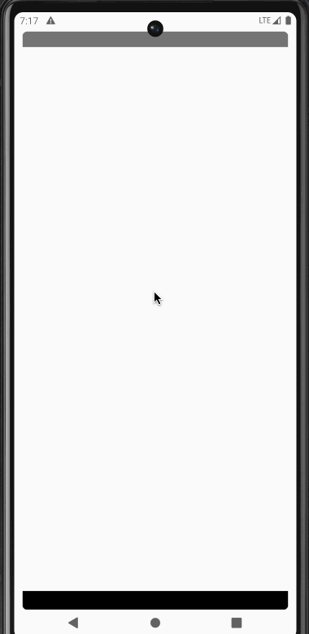

When we try any new technology one of the key factors in convincing the team to adopt it is to have a good tooling and dev experience. The dev experience needs to be as close as possible to the current experience that if not better.

Our team started migrating an existing android repository to a Kotlin Multiplatform one. We decided to go all in on muliplatform and decided to share UI as well using Compose Multiplication(more on the in other articles).

One of the core things which we had to migrate is our network module which was build on top of OkHttp and retrofit on Android (More on how we exported some of our native code which was was required for custom checksum and encryption logic to other platforms later. Basically from just .so files on Linux based OS to supposing .dll and .dylib for windows and mac based OS). We converted our OkHttp interceptiors to Ktor plugins one by one and migrated to kotlinx serialization to complete migration.

In our Android only repo, we were using Chuck to see the network calls. Our dev and QA team is very much used to this tool for sometime. Though the Logger plugin in Ktor can log the network calls, it has limitations when running the app in standalone mode, not through an IDE (especially by the QA team) and when multiple requests are made to same end point within a short interval of time, it’s difficult to visualise and associate responses to requests. Also, everyone was already so used to “Chuck way” of looking at all the network calls for developers, debugging and testing.

When we looked if there is any KMP solution for the same, we couldn’t find one. So we ended up creating a small library for the same. Please check [ktor-network-monitor Github Repo](https://github.com/chethann/ktor-network-monitor).

A small demo on Android:

More deatils on the library and its usage on other target platform is explained in the github page. 

This is very first version and has its limitations. But, good enough to start using as part of development build.
We want to add features like **exporting as curl**, supporting native **UI for visualisation** (right now only CMP), improve stability and fix issues in some edge cases, support other data sources other than room if someone wants to do so.

The repos also ships a Ktor server that can be used to test the library (More on this approach of development in some article).

You can checkout the library and try in the sample project and provide your feedback. 