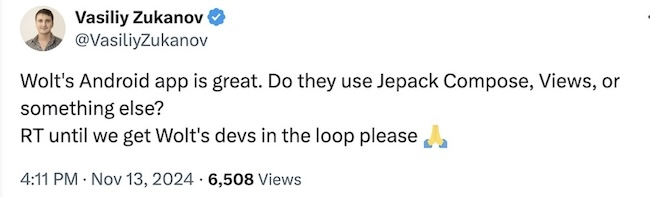
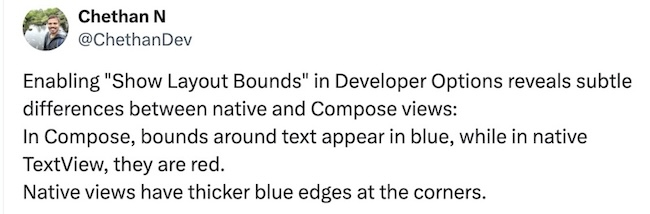
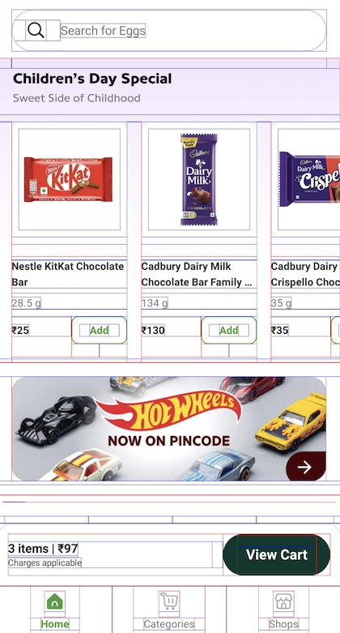
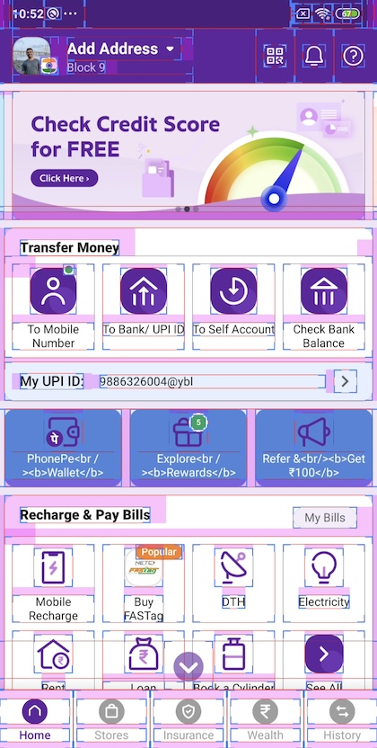
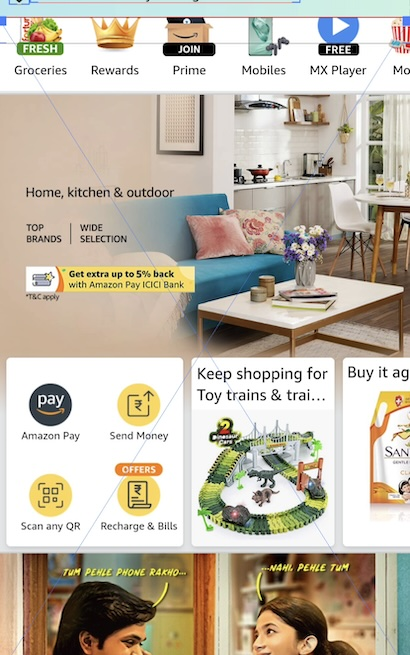

As I was scrolling throw my twitter feed, I saw this [tweet](https://x.com/VasiliyZukanov/status/1856648593672740928) from [Vasiliy Zukanov](https://x.com/vasiliyzukanov?s=21).
He was curious if Wolt’s Android app was build using Jetpack Compose.

I shared a trick I use to check if any screen is build using Compose or native views. This involves enabling the developer option and turn on "Show layout bounds" option and observer the bounds closly. This trick can come in handly if you want to know if any screen in any app is built using Compose or it uses native views.

[tweet](https://x.com/ChethanDev/status/1856730080753684689).

Just sharing the trick here, it works as on November 2024. Not sure if it will be true for future versions of Compose.

Basically, when we enable ***“Show layout bounds”*** option from developer setting, it shows bounds a little differently for Native Views and compose ones.

Layout bounds of a screen built using Compose look like below. You can see that there is **no thick blue corners** in the bounds and the **borders around text and image are blue** in color.  

Layout bounds of a screen built using navtive views look like below. You can see that there is thick blue corners in the bounds and the borders around text and image are red in color.

**Bonus:** If you don’t see any borders around the UI elements, then the screen is most likely a web view.
Ex: Amazon

As **react native uses the native views**, the layout bounds in case of react native would be similar to that of native views.

For flutter apps, there is **no layout bounds by default** (It can be explictly enabled by developer for testing though) similar to that of webview. 

